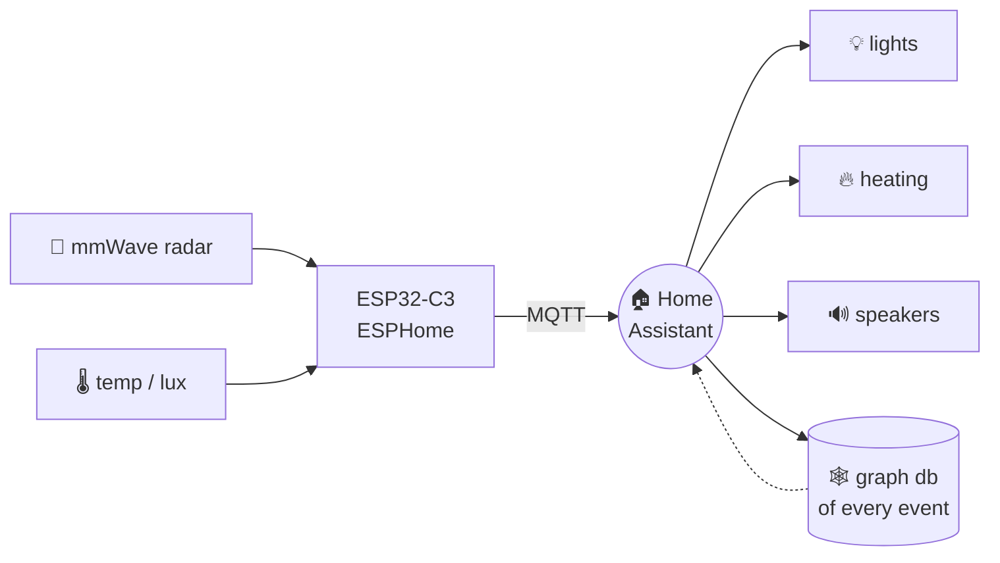

<!-- ✦ animated intro · light & dark variants ✦ -->
<picture>
  <source media="(prefers-color-scheme: dark)" srcset="https://readme-typing-svg.demolab.com?font=JetBrains+Mono&weight=600&size=25&duration=3200&pause=1000&color=FAB387&center=true&vCenter=true&width=620&height=60&lines=Hey%2C%20I%27m%20Th%C3%A9o%20%F0%9F%91%8B;software%20student%20%26%20maker;my%20house%20knows%20when%20I%27m%20home;currently%20lost%20in%20graph%20databases;the%203D%20printer%20never%20sleeps;ask%20me%20about%20mmWave%20radar" />
  
</picture>

<samp>🇨🇭 Geneva, Switzerland &nbsp;·&nbsp; student by day, maker by night</samp>

 

<!-- 🏠 self-hosted animated svg · assets/house.svg -->

## ☕ about me

<samp>everything below is a drawer &nbsp;·&nbsp; click to open</samp>

<b>🎓 what I'm studying</b>

 

software dev student, currently deep in NoSQL land: MongoDB ⇄ ArangoDB graph pipelines in C# / .NET 8.
turns out modelling a house as a graph is much nicer than modelling it as 40 rows in a table.

<b>🏠 the house that knows</b>

 

ESP32-C3 boards + mmWave presence radar in most rooms, all talking ESPHome to Home Assistant.
no PIR sensors, no "the lights turned off because I stopped moving" nonsense.

<i>...and what actually breaks</i>

 

- radar picks up the neighbour through the wall → lights on at 3am
- wifi drops → the house forgets I exist
- I flash new firmware at midnight → see above

<b>🖨️ the printer that never sleeps</b>

 

about a decade of 3D printing now. if it can be printed, it will be printed —
enclosures for the ESP boards, brackets, and an unreasonable number of things that hold other things.

<b>📌 currently</b>

 

- [x] wire the ground floor with presence sensors
- [x] get ArangoDB traversals into the .NET side
- [ ] first floor (the wiring is *right there*, I promise)
- [ ] stop starting new projects
- [ ] ~~stop starting new projects~~

## 🧰 toolbox

<!-- swap icons freely · full list: https://skillicons.dev -->

 

  

## 📈 stats

<picture>
  <source media="(prefers-color-scheme: dark)" srcset="https://github-readme-stats.vercel.app/api?username=theo-bggtt&show_icons=true&hide_border=true&theme=catppuccin_mocha" />
  
</picture>
&nbsp;
<picture>
  <source media="(prefers-color-scheme: dark)" srcset="https://streak-stats.demolab.com?user=theo-bggtt&hide_border=true&theme=catppuccin-mocha" />
  
</picture>

  

<picture>
  <source media="(prefers-color-scheme: dark)" srcset="https://github-readme-stats.vercel.app/api/top-langs/?username=theo-bggtt&layout=compact&langs_count=8&hide_border=true&theme=catppuccin_mocha" />
  
</picture>

  

<!-- 📉 last 31 days of activity, redrawn on every page load -->
<picture>
  <source media="(prefers-color-scheme: dark)" srcset="https://github-readme-activity-graph.vercel.app/graph?username=theo-bggtt&bg_color=00000000&color=cdd6f4&title_color=cba6f7&line=cba6f7&point=fab387&area=true&area_color=cba6f7&hide_border=true&custom_title=last%2031%20days" />
  
</picture>

  

<!-- 🐍 generated by .github/workflows/snake.yml · appears after the first workflow run -->
<picture>
  <source media="(prefers-color-scheme: dark)" srcset="https://raw.githubusercontent.com/theo-bggtt/theo-bggtt/output/github-snake-dark.svg" />
  <source media="(prefers-color-scheme: light)" srcset="https://raw.githubusercontent.com/theo-bggtt/theo-bggtt/output/github-snake.svg" />
  
</picture>

&nbsp;

  

built with ☕, a soldering iron and a 3D printer that never sleeps

